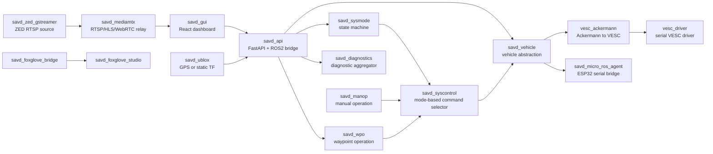

# SAVD Vehicle Platform Onboarding and Test Guide

Last updated: 2026-06-02  
Inspection baseline: 2026-06-01  
Vehicle host: `172.21.16.162`  
SSH login: `user@172.21.16.162`  
Host name observed: `GTW-ONX1-E1A4T4E1`  
Operating system observed: Ubuntu 22.04.5 LTS, NVIDIA Jetson, aarch64  
Docker version observed: 28.0.4

## 1. Purpose of This Guide

This document is a beginner-friendly technical guide for the SAVD small vehicle test platform. It explains what the vehicle can do, how the GUI is connected to the ROS2 backend, what each Docker container does, where the source files live, and how a new student should safely test the system.

The goal is that a new person can read this document and immediately understand:

- What the vehicle functions are.
- How to connect to the vehicle.
- What should be checked first.
- Which GUI panel talks to which backend service.
- Which Docker container owns each function.
- Which ROS2 topics, services, and actions are important.
- What is currently working and what is currently suspicious or broken.
- Which commands are safe for read-only inspection.
- Which actions can physically move the vehicle and must be treated as dangerous.

This guide is based on read-only inspection. No remote files were modified, no Docker containers were restarted, and no recovery scripts were executed during the inspection.

## 1.1 Evidence and Confidence

This guide is not written from imagination. It is based on a read-only SSH inspection of the vehicle on 2026-06-01, including Docker state, Docker Compose files, container launch commands, source directories inside containers, GUI source files, ROS2 nodes/topics/services/actions, API responses, diagnostics, logs, and camera endpoint tests.

However, the vehicle is a live system. Runtime status can change after the inspection. For example, a camera may recover, a container may restart, a joystick may be plugged in, or the vehicle may move to a different network.

Use these confidence labels when reading the document:

| Label | Meaning |
| --- | --- |
| Directly observed | Verified from SSH, Docker, source files, ROS2 CLI, logs, API responses, or camera endpoint tests during inspection. |
| Source-code based | Derived from inspected source code, launch files, configuration files, or GUI code. |
| Inferred | A careful engineering interpretation of how components connect, based on observed topics, services, API calls, and source code. |
| Baseline only | A runtime condition observed at inspection time. It must be rechecked before a new test session. |

Examples:

- Container names, source paths, launch commands, API endpoints, and ROS2 topic/service/action names are directly observed or source-code based.
- The explanation of GUI-to-ROS control flow is source-code based and inferred from observed API/ROS interfaces.
- Statements like "rear camera is broken", "JetsonStats is exited", "U-Blox is stale", and "`/dev/input/js0` is missing" are baseline-only observations from 2026-06-01.

Follow-up verification attempt:

- On 2026-06-02, a new read-only reachability check from the laptop to `172.21.16.162` timed out for SSH, ping, GUI port `3000`, and API port `8000`.
- Because the vehicle was unreachable at that moment, the current live runtime state could not be reverified.
- Therefore, this document should be treated as a detailed inspection baseline and onboarding guide, not as a continuously live status dashboard.

## 2. One-Page Summary

The SAVD platform is a ROS2-based vehicle system running inside Docker containers on a Jetson computer. The user-facing GUI is a React web application. The GUI sends HTTP requests to a FastAPI backend. The API backend converts those requests into ROS2 topics, services, and actions. ROS2 containers then control the VESC motor controller, the ESP32/microcontroller, the ZED cameras, GPS, diagnostics, and driving modes.

The system is not one program. It is a containerized distributed vehicle stack.

### 2.1 Main Things the Vehicle Can Do

- Show a browser dashboard at `http://172.21.16.162:3000`.
- Show vehicle speed, curvature, VESC status, ESP32 state, and battery estimate.
- Switch driving modes such as `IDLE`, `MANOP`, `MANOP_MOVE`, `WPO`, `ESTOP`, and error-related modes.
- Send manual driving commands from the GUI virtual joystick.
- Receive physical joystick input from a Logitech F710-style controller when `/dev/input/js0` exists.
- Control ESP32-connected actuators such as gear, front differential lock, rear differential lock, and fan.
- Stream ZED camera video through RTSP/HLS/WebRTC.
- Display a Mapbox map and send waypoint goals.
- Run waypoint operation through a pure-pursuit-style path follower.
- Expose ROS2 data to Foxglove for debugging.
- Aggregate diagnostics and show a system status in the GUI.

### 2.2 Current Baseline Observed During Inspection

These are observations from the inspection baseline. They should be rechecked before a new experiment because the vehicle state can change.

| Area | Observed status | Meaning |
| --- | --- | --- |
| GUI | Online at port `3000` | The main dashboard loads. |
| API | Online at port `8000` | FastAPI bridge is serving requests. |
| VESC | Connected | The VESC driver reports connection and firmware information. |
| micro-ROS / ESP32 | Connected | Vehicle parameters report `micro_ros_connection = connected`. |
| Front camera | Working | `zed-front` stream is available. |
| Rear camera | Broken | `zed-rear` source returns `503 Service Unavailable`; GUI shows `stream not found`. |
| GPS / U-Blox | Not really active | The real U-Blox node is commented out in the launch file; only static transforms are published. |
| Jetson Stats | Broken/stale | `savd_jetson_stats` container was exited with status `127`. |
| Physical joystick | Not detected | `/dev/input/js0` was not present during inspection. |
| System Status | ERROR | Diagnostics aggregate stale/error components. |

### 2.3 Where a New Student Should Start

Start in this order:

1. Read the safety section.
2. Open the GUI at `http://172.21.16.162:3000`.
3. Confirm the vehicle is physically safe: wheels lifted or vehicle disabled, enough space, emergency stop understood.
4. SSH into the vehicle and check Docker status using read-only commands.
5. Check API status and diagnostics.
6. Test front camera only.
7. Test VESC and ESP32 status without moving the vehicle.
8. Only after supervision, test manual joystick commands with the wheels lifted.
9. Only after manual control is understood, test waypoint behavior.

## 3. Safety Rules

This vehicle has software interfaces that can command motor speed, steering, gear, differential locks, fan, and driving modes. Treat the platform as a real robot, not just a web application.

### 3.1 Minimum Safety Checklist Before Any Movement Test

Before sending any command that can move the vehicle:

- The vehicle must be on a stable stand or have its wheels lifted from the ground.
- The operator must know how to trigger `ESTOP`.
- The GUI `STOP` button must be visible.
- The mode shown in the GUI must be understood.
- The surrounding area must be clear.
- The battery and power wiring must be safe.
- One person should watch the physical vehicle while another person uses the GUI.
- Do not run waypoint tests indoors unless the vehicle is immobilized.
- Do not assume that `SYSTEM ERROR` means the vehicle cannot move. Some motion-related components can still be connected.

### 3.2 Commands and API Calls That Can Be Dangerous

These operations can affect the physical vehicle:

```text
PUT /modes/set_mode/{mode}
PUT /manual/send_joy_cmds
PUT /vehicle/set_gear/{gear}
PUT /vehicle/set_diff_lock/{cmd}
PUT /vehicle/set_fan_speed/{speed}
POST /wpo/send_waypoints
POST /wpo/cancel_goal
```

Do not run these casually from `curl`, Python, Postman, or the GUI unless the test is planned.

### 3.3 Recovery Scripts Need Permission

The project directory contains scripts such as:

```text
/home/user/savd/savd_docker/recover_dual_cameras.sh
/home/user/savd/savd_docker/start_stack_camera_stable.sh
/home/user/savd/savd_docker/start_stack.sh
```

These may restart containers, reset camera devices, or alter the running state. Use them only after confirming with the team or supervisor.

## 4. Network and Login

The vehicle is accessed on a local network.

```text
ssh user@172.21.16.162
```

Use the lab-provided password or SSH key. Do not commit credentials into the documentation repository.

After logging in, the main project directory is:

```text
/home/user/savd/savd_docker
```

Recommended first command:

```bash
hostname
```

Expected host name observed during inspection:

```text
GTW-ONX1-E1A4T4E1
```

## 5. Main Web Endpoints

| Function | URL or port | Container |
| --- | --- | --- |
| Main vehicle GUI | `http://172.21.16.162:3000` | `savd_gui` |
| REST API | `http://172.21.16.162:8000` | `savd_api` |
| API OpenAPI JSON | `http://172.21.16.162:8000/openapi.json` | `savd_api` |
| Foxglove Studio | `http://172.21.16.162:8080` | `savd_foxglove_studio` |
| Foxglove Bridge | `ws://172.21.16.162:8765` | `savd_foxglove_bridge` |
| ZED raw RTSP source | `rtsp://172.21.16.162:8554/...` | `savd_zed_gstreamer` |
| MediaMTX RTSP relay | `rtsp://172.21.16.162:8553/...` | `savd_mediamtx` |
| MediaMTX HLS | `http://172.21.16.162:8888/...` | `savd_mediamtx` |
| MediaMTX WebRTC | `http://172.21.16.162:8889/...` | `savd_mediamtx` |
| MediaMTX metrics | `http://172.21.16.162:9998` | `savd_mediamtx` |

## 6. Mental Model of the System

The platform can be understood as four layers.

### 6.1 Web Layer

The web layer contains:

- `savd_gui`: React dashboard.
- `savd_api`: FastAPI server that bridges HTTP to ROS2.

The GUI almost never talks directly to ROS2. It calls HTTP endpoints on the API. The only major exception is camera video: the GUI embeds the MediaMTX WebRTC pages directly.

### 6.2 Mode and Decision Layer

The mode layer contains:

- `savd_sysmode`: Owns the vehicle state machine.
- `savd_syscontrol`: Selects which driving source is allowed to control the vehicle.

This layer decides whether manual driving, waypoint driving, or some other mode is active.

### 6.3 Vehicle Control Layer

The vehicle control layer contains:

- `savd_manop`: Manual operation from joystick input.
- `savd_wpo`: Waypoint operation and path following.
- `savd_vehicle`: Vehicle hardware abstraction.
- `vesc_ackermann`: Converts Ackermann commands to VESC commands.
- `vesc_driver`: Talks to the VESC motor controller.
- `savd_micro_ros_agent`: Talks to the ESP32/microcontroller.

This layer turns high-level driving requests into motor, steering, and actuator commands.

### 6.4 Sensor, Camera, and Diagnostics Layer

This layer contains:

- `savd_zed_gstreamer`: ZED camera RTSP source.
- `savd_mediamtx`: RTSP/HLS/WebRTC relay.
- `savd_ublox`: GPS/U-Blox and static transforms.
- `savd_diagnostics`: Diagnostic aggregator.
- `savd_jetson_stats`: Jetson system statistics, currently exited.
- `savd_foxglove_bridge`: ROS2 debug bridge.
- `savd_foxglove_studio`: Browser-based Foxglove UI.

## 7. Architecture Diagram



## 8. First-Time Read-Only Inspection Procedure

This procedure is safe because it only reads state. It does not command the vehicle.

### 8.1 Connect by SSH

```bash
ssh user@172.21.16.162
```

Then run:

```bash
hostname
pwd
ls /home/user/savd
```

Expected project directory:

```text
/home/user/savd/savd_docker
```

### 8.2 Check Docker Compose Projects

```bash
docker compose ls
```

Expected main project observed:

```text
savd_docker running(17)
```

Then:

```bash
cd /home/user/savd/savd_docker
docker compose ps
```

You should see most SAVD containers running. It is normal, based on the baseline, that `savd_jetson_stats` may be exited.

### 8.3 Check Main Ports

From your laptop, open:

```text
http://172.21.16.162:3000
http://172.21.16.162:8000/openapi.json
http://172.21.16.162:8080
```

Expected result:

- Port `3000`: main GUI loads.
- Port `8000`: API responds.
- Port `8080`: Foxglove Studio loads.

### 8.4 Read API Status

From any machine on the same LAN:

```bash
curl http://172.21.16.162:8000/current_time
curl http://172.21.16.162:8000/modes/get_current_mode
curl http://172.21.16.162:8000/vehicle/parameters
curl http://172.21.16.162:8000/diagnostics
```

These are read-only endpoints except that they may still touch backend service logic. They should not command motion.

### 8.5 Inspect ROS2 From Inside a ROS Container

The ROS2 tools are available inside ROS containers. A useful container is `savd_api`.

Example:

```bash
docker exec -it savd_docker-savd_api-1 bash
ros2 node list
ros2 topic list
ros2 service list
ros2 action list
```

Exit the container shell with:

```bash
exit
```

## 9. GUI Walkthrough

The GUI in the screenshot is the main operator dashboard. It is served by `savd_gui` and calls `savd_api`.

### 9.1 Header

The top bar shows:

- Application name: `SAVD`.
- Battery estimate, shown as a percentage.

The battery estimate comes from vehicle/battery state data exposed by the API.

### 9.2 VESC Info Panel

GUI source:

```text
/app/src/components/VESCInfo.tsx
```

Backend endpoints:

```text
/vehicle/parameters
/vehicle/odom
```

Backend chain:

```text
savd_gui
  -> savd_api
  -> savd_vehicle
  -> vesc_ackermann
  -> vesc_driver
  -> VESC hardware
```

What it shows:

- VESC connection indicator.
- Vehicle velocity.
- Vehicle curvature.

What a beginner should check:

- If VESC indicator is green, the VESC connection is likely alive.
- If velocity and curvature remain zero while the vehicle is stationary, that is expected.
- If `/vehicle/odom` returns unavailable, odometry may not be active even if VESC is connected.

### 9.3 ESP32 Control Panel

GUI source:

```text
/app/src/components/ESP32Control.tsx
```

Backend endpoints:

```text
/vehicle/parameters
/vehicle/set_gear/{gear}
/vehicle/set_diff_lock/{cmd}
/vehicle/set_fan_speed/{speed}
```

Backend chain:

```text
savd_gui
  -> savd_api
  -> savd_vehicle
  -> savd_micro_ros_agent
  -> ESP32 or microcontroller
```

What it controls:

- Gear selection.
- Front differential lock.
- Rear differential lock.
- Fan speed or fan on/off state.

Safety note:

These controls affect physical actuators. Do not toggle them during an unsafe mechanical state.

### 9.4 Camera Panels

GUI source:

```text
/app/src/components/Dashboard.tsx
```

The GUI embeds:

```text
http://<host>:8889/zed-front
http://<host>:8889/zed-rear
```

Backend chain:

```text
ZED camera
  -> savd_zed_gstreamer
  -> RTSP source at port 8554
  -> savd_mediamtx
  -> WebRTC/HLS/RTSP relay
  -> savd_gui iframe
```

Observed baseline:

- Front stream works.
- Rear stream fails with `stream not found`.

Important detail:

The diagnostics panel can show ZED stale even when the front video works. This is because the active camera path is direct GStreamer/RTSP, not necessarily a ROS2 ZED diagnostics publisher.

### 9.5 Mapbox Map Panel

GUI source:

```text
/app/src/components/Mapbox.tsx
```

Backend endpoints:

```text
/wpo/send_waypoints
/wpo/cancel_goal
/wpo/path
/wpo/pure_pursuit/current_pose
/sensors/gps/fix
/sensors/navsat/fix
/sensors/geo/pose
```

Backend chain for waypoint driving:

```text
savd_gui Mapbox
  -> savd_api
  -> /savd_wpo/waypoints action
  -> savd_wpo
  -> pure_pursuit
  -> /savd_wpo/drive_cmds
  -> savd_syscontrol
  -> savd_vehicle
  -> VESC stack
```

What the buttons mean:

- `SEND`: send selected waypoint path to the waypoint operation action server.
- `CANCEL`: cancel the current waypoint goal.
- `CENTER`: recenter the map view.

Safety note:

Waypoint commands can lead to autonomous driving behavior. Do not test this with the vehicle on the ground until localization, mode handling, and manual stop are understood.

### 9.6 TIME Synced Panel

GUI source:

```text
/app/src/components/TimeSync.tsx
/app/src/App.tsx
```

Backend endpoint:

```text
/current_time
```

What it shows:

- Current time from the API.
- Round-trip time from GUI to API.

This is a useful quick check that the GUI and API are communicating.

### 9.7 SYSTEM Status Panel

GUI source:

```text
/app/src/components/SystemStatus.tsx
/app/src/App.tsx
```

Backend endpoint:

```text
/diagnostics
```

Backend chain:

```text
savd_diagnostics
  -> /diagnostics_agg
  -> savd_api
  -> savd_gui
```

Observed baseline:

The GUI showed `ERROR`. The aggregated diagnostics included stale or error components such as:

```text
ZEDXFront stale
ZEDXRear stale
JetsonStats stale
U-Blox stale
Vehicle error
```

Important interpretation:

`SYSTEM ERROR` does not mean every subsystem is dead. It means at least one monitored diagnostic group is stale or reporting error. The vehicle may still have VESC and micro-ROS connected.

### 9.8 Mode Selector

GUI source:

```text
/app/src/components/Mode.tsx
```

Backend endpoints:

```text
/modes/get_current_mode
/modes/get_modes
/modes/set_mode/{mode}
```

Backend container:

```text
savd_sysmode
```

Observed mode during baseline:

```text
IDLE
```

Common modes:

```text
DISABLED
IDLE
ERROR
ESTOP
ERRACK
MANOP
MANOP_MOVE
WPO
WPO_MOVE
WPO_FINAL
WPO_ERROR
```

### 9.9 STOP Button

GUI source:

```text
/app/src/components/Dashboard.tsx
```

Backend operation:

```text
set mode to ESTOP
```

Use:

- This is the GUI-level stop command.
- It should be visible before any motion test.
- It should not be the only emergency stop method. A physical safety procedure should also exist.

### 9.10 Virtual Joystick

GUI source:

```text
/app/src/components/Dashboard.tsx
```

Backend endpoint:

```text
/manual/send_joy_cmds
```

Backend ROS topic:

```text
/savd_manop/joy_cmds_2
```

Observed behavior:

- The GUI sends joystick commands approximately every 50 ms.
- These commands are consumed by `savd_manop`.
- `savd_manop` turns them into drive commands.

Safety note:

This can move the vehicle if the mode chain allows it.

## 10. Functional Test Plan for New Students

Use this section as a test checklist. Each test includes purpose, steps, expected result, and danger level.

### Test 0: Physical Safety Setup

Danger level: high if ignored.

Purpose:

Make sure the vehicle is physically safe before interacting with software controls.

Steps:

1. Place the vehicle on a stable stand if any movement command may be sent.
2. Confirm wheels can spin freely without touching the ground.
3. Confirm the operator can reach power or physical emergency stop.
4. Open the GUI and confirm the STOP button is visible.
5. Do not touch the joystick yet.

Expected result:

- Vehicle is safe to command.
- Everyone knows how to stop the test.

Do not continue to motion tests if this fails.

### Test 1: Network and SSH

Danger level: low.

Purpose:

Confirm the laptop can reach the vehicle.

Steps:

```bash
ping 172.21.16.162
ssh user@172.21.16.162
hostname
```

Expected result:

```text
GTW-ONX1-E1A4T4E1
```

If this fails:

- Check that the laptop is on the same local network.
- Check the vehicle power.
- Check the IP address.

### Test 2: Docker Stack Health

Danger level: low if using read-only commands.

Purpose:

Confirm that the expected containers are present.

Steps:

```bash
cd /home/user/savd/savd_docker
docker compose ls
docker compose ps
docker ps --format "table {{.Names}}\t{{.Status}}\t{{.Image}}"
```

Expected result:

- Compose project `savd_docker` is running.
- Most containers are up.
- `savd_jetson_stats` may be exited in the current baseline.

If this fails:

- Do not restart immediately.
- Record which containers are missing.
- Ask the project owner before running recovery scripts.

### Test 3: GUI and API Connectivity

Danger level: low.

Purpose:

Confirm the GUI can talk to the API.

Steps:

1. Open `http://172.21.16.162:3000`.
2. Check the TIME panel.
3. Run:

```bash
curl http://172.21.16.162:8000/current_time
curl http://172.21.16.162:8000/modes/get_current_mode
```

Expected result:

- GUI loads.
- TIME panel updates.
- API returns JSON.
- Current mode is returned, often `IDLE`.

If this fails:

- If GUI works but API fails, inspect `savd_api`.
- If API works but GUI fails, inspect `savd_gui`.
- If both fail, inspect Docker and host networking.

### Test 4: Diagnostics Readout

Danger level: low.

Purpose:

Understand why the GUI says `SYSTEM ERROR`.

Steps:

```bash
curl http://172.21.16.162:8000/diagnostics
```

Expected result:

- A diagnostic summary is returned.
- Some groups may be `OK`.
- Some groups may be `STALE` or `ERROR`.

Baseline explanation:

- `ManOp`, `SysControl`, and `SysMode` were OK.
- `U-Blox`, `JetsonStats`, and ZED diagnostics were stale.
- Vehicle diagnostics reported error conditions.

If this fails:

- Check `savd_diagnostics`.
- Check `/diagnostics_agg` in ROS2.

### Test 5: VESC and Vehicle Parameters

Danger level: low for read-only check.

Purpose:

Check whether the VESC and vehicle abstraction are connected.

Steps:

```bash
curl http://172.21.16.162:8000/vehicle/parameters
curl http://172.21.16.162:8000/vehicle/battery_state
curl http://172.21.16.162:8000/vehicle/odom
```

Expected result:

- `vesc_connection` should be connected.
- `micro_ros_connection` should be connected.
- Gear, differential, and fan state should be present.
- Odometry may be unavailable depending on state.

Baseline observed:

```text
micro_ros_connection = connected
vesc_connection = connected
servo_gear = HIGH
servo_diff_front = ON
servo_diff_rear = OFF
fan_speed = 0
fault_code = 0
```

If this fails:

- Check `savd_vehicle`.
- Check `vesc_driver`.
- Check serial devices under `/dev/serial/by-id`.

### Test 6: Front Camera Stream

Danger level: low.

Purpose:

Confirm the front ZED stream is available.

Steps:

Open in a browser:

```text
http://172.21.16.162:8889/zed-front
```

Or test HLS:

```bash
curl http://172.21.16.162:8888/zed-front/index.m3u8
```

Expected result:

- Front video appears in the GUI or MediaMTX WebRTC page.
- HLS playlist returns text.

If this fails:

- Check `savd_zed_gstreamer`.
- Check `savd_mediamtx`.
- Check whether camera devices are available.

### Test 7: Rear Camera Stream

Danger level: low.

Purpose:

Confirm the known rear camera issue.

Steps:

Open:

```text
http://172.21.16.162:8889/zed-rear
```

Expected baseline result:

- It may fail with `stream not found`.

Technical baseline:

```text
rtsp://172.21.16.162:8554/zed-rear -> 503 Service Unavailable
rtsp://172.21.16.162:8553/zed-rear -> 404 Not Found
```

Interpretation:

The problem is likely at the ZED/GStreamer source side, not just the GUI.

### Test 8: Foxglove Debug View

Danger level: low if only observing.

Purpose:

Use Foxglove to inspect ROS2 topics visually.

Steps:

1. Open `http://172.21.16.162:8080`.
2. Connect to Foxglove bridge, usually at `ws://172.21.16.162:8765`.
3. Inspect topics such as:

```text
/savd_sysmode/mode
/savd_vehicle/parameters
/diagnostics_agg
/sensors/core
/odom
```

Expected result:

- Foxglove can connect.
- ROS2 topic data appears if the corresponding node is publishing.

### Test 9: Manual Control Dry Run

Danger level: high.

Purpose:

Verify GUI virtual joystick command flow without driving on the ground.

Required setup:

- Vehicle wheels lifted.
- Operator ready to press STOP.
- Supervisor present.
- Current mode understood.

Steps:

1. Open GUI.
2. Confirm mode and diagnostics.
3. Confirm VESC and micro-ROS are connected.
4. Use the GUI virtual joystick very gently.
5. Observe whether command topics change in Foxglove or ROS2.
6. Press STOP.

Expected command chain:

```text
GUI joystick
  -> /manual/send_joy_cmds
  -> /savd_manop/joy_cmds_2
  -> savd_manop
  -> /savd_manop/drive_cmds
  -> savd_syscontrol
  -> /savd_syscontrol/drive_cmds
  -> savd_vehicle
  -> /ackermann_cmd
  -> vesc_ackermann
  -> /commands/motor/speed and /commands/servo/position
  -> vesc_driver
```

If this fails:

- Check the current mode.
- Check `savd_manop`.
- Check `savd_syscontrol`.
- Check whether `savd_sysmode` allows manual movement.

### Test 10: ESP32 Actuator Dry Run

Danger level: medium to high.

Purpose:

Verify gear, differential, and fan control.

Required setup:

- Vehicle mechanically safe.
- No one touching drivetrain components.
- Understand which actuator is being toggled.

Steps:

1. Read current parameters:

```bash
curl http://172.21.16.162:8000/vehicle/parameters
```

2. In the GUI, observe gear/diff/fan state.
3. Only if approved, toggle one actuator.
4. Read parameters again.

Expected result:

- API state changes.
- micro-ROS remains connected.

If this fails:

- Check `savd_vehicle`.
- Check `savd_micro_ros_agent`.
- Check ESP32 serial device.

### Test 11: Waypoint Operation Dry Run

Danger level: high.

Purpose:

Understand waypoint behavior before real autonomous driving.

Required setup:

- Vehicle immobilized or in a safe test area.
- Localization status understood.
- STOP procedure ready.

Steps:

1. Open the map panel.
2. Check GPS and pose endpoints:

```bash
curl http://172.21.16.162:8000/sensors/gps/fix
curl http://172.21.16.162:8000/sensors/navsat/fix
curl http://172.21.16.162:8000/sensors/geo/pose
```

3. Check WPO topics in Foxglove.
4. Do not press `SEND` unless the test is planned.

Expected baseline:

- GPS may not be available because the U-Blox node is commented out.
- WPO action server exists.

If this fails:

- Check `savd_wpo`.
- Check `savd_ublox`.
- Check pose source assumptions.

## 11. Container-by-Container Guide

This section explains each container, its source files, and how it fits into the platform.

### 11.1 `savd_docker-savd_gui-1`

Image:

```text
dockertest3.azurecr.io/savd/gui:latest
```

Run command:

```text
yarn start
```

Main source paths inside the container:

```text
/app
/app/src/App.tsx
/app/src/components/Dashboard.tsx
/app/src/components/VESCInfo.tsx
/app/src/components/ESP32Control.tsx
/app/src/components/SystemStatus.tsx
/app/src/components/TimeSync.tsx
/app/src/components/Mode.tsx
/app/src/components/Mapbox.tsx
/app/src/components/Cameras.tsx
/app/src/components/Foxglove.tsx
/app/src/client
```

Purpose:

This is the browser dashboard. It is what the operator sees in the screenshot.

Main responsibilities:

- Render the SAVD operator interface.
- Display VESC information.
- Display ESP32 actuator controls.
- Display front and rear camera iframes.
- Display Mapbox map and waypoint controls.
- Display time sync and diagnostics status.
- Display current mode and allow mode switching.
- Send virtual joystick commands.
- Send STOP command by switching to `ESTOP`.

Important implementation detail:

`App.tsx` sets the API base dynamically:

```text
http://<browser hostname>:8000
```

So if the GUI is opened at:

```text
http://172.21.16.162:3000
```

then the API is called at:

```text
http://172.21.16.162:8000
```

How to test it:

- Open `http://172.21.16.162:3000`.
- Confirm the dashboard loads.
- Confirm TIME RTT updates.
- Confirm the VESC/ESP32 panels show values.

Common failure modes:

- GUI loads but values are stale: API or ROS2 backend may be down.
- Camera panels fail: MediaMTX or ZED source issue.
- Map does not load: Mapbox token/network issue or missing pose data.

### 11.2 `savd_docker-savd_api-1`

Image:

```text
ros-humble-api:v1.0
```

Run command:

```text
ros2 launch savd_api savd_api.launch.py
```

Main source paths:

```text
/home/ubuntu/ros2_ws/src/savd_api
/home/ubuntu/ros2_ws/src/savd_api/savd_api/main.py
/home/ubuntu/ros2_ws/src/savd_api/setup.py
```

Purpose:

This container is the HTTP-to-ROS2 bridge. It provides the REST API that the GUI uses.

Main ROS2 subscriptions:

```text
/savd_vehicle/odom
/savd_vehicle/parameters
/savd_vehicle/battery_state
/diagnostics_agg
/gpsfix
/ublox_gps_node/fix
/zed_multi/zed_front/geo_pose
/savd_sysmode/mode
/savd_wpo/path
/savd_wpo/current_pose
/savd_wpo/target_pose
```

Main ROS2 publisher:

```text
/savd_manop/joy_cmds_2
```

Main service clients:

```text
/savd_sysmode/get_modes
/savd_sysmode/set_mode
/savd_vehicle/set_gear
/savd_vehicle/set_diff_lock
/savd_vehicle/set_fan_speed
```

Main action client:

```text
/savd_wpo/waypoints
```

Important HTTP endpoints:

```text
GET  /current_time
GET  /diagnostics
PUT  /manual/send_joy_cmds
GET  /modes/get_current_mode
GET  /modes/get_modes
PUT  /modes/set_mode/{mode}
GET  /vehicle/parameters
GET  /vehicle/odom
GET  /vehicle/battery_state
PUT  /vehicle/set_gear/{gear}
PUT  /vehicle/set_diff_lock/{cmd}
PUT  /vehicle/set_fan_speed/{speed}
POST /wpo/send_waypoints
POST /wpo/cancel_goal
GET  /wpo/path
GET  /sensors/gps/fix
GET  /sensors/navsat/fix
GET  /sensors/geo/pose
```

How to test it:

```bash
curl http://172.21.16.162:8000/current_time
curl http://172.21.16.162:8000/openapi.json
```

Common failure modes:

- API responds but data missing: ROS2 topic or service not available.
- GUI cannot control mode: `savd_sysmode` service issue.
- Manual joystick does nothing: check `/savd_manop/joy_cmds_2` and `savd_manop`.

### 11.3 `savd_docker-savd_sysmode-1`

Image:

```text
ros-humble-sysmode:v1.0
```

Run command:

```text
ros2 launch savd_sysmode savd_sysmode.launch.py
```

Main source paths:

```text
/home/ubuntu/ros2_ws/src/savd_sysmode
/home/ubuntu/ros2_ws/src/savd_sysmode/src
/home/ubuntu/ros2_ws/src/savd_sysmode/resources/statemachine.xml
```

Purpose:

This is the vehicle mode state machine. It owns the current operating mode.

Main interfaces:

```text
publish: /savd_sysmode/mode
service: /savd_sysmode/set_mode
service: /savd_sysmode/get_modes
```

Modes found in the state machine:

```text
DISABLED
IDLE
ERROR
ESTOP
ERRACK
MANOP
RUTINE
MANOP_MOVE
WPO
WPO_MOVE
WPO_FINAL
WPO_ERROR
```

Mode metadata:

```text
MANOP  -> /savd_manop/drive_cmds
RUTINE -> /savd_rutine/drive_cmds
WPO    -> /savd_wpo/drive_cmds
```

How to test it:

```bash
curl http://172.21.16.162:8000/modes/get_modes
curl http://172.21.16.162:8000/modes/get_current_mode
```

What beginners should understand:

- Mode selection decides which control path can command the vehicle.
- The GUI mode dropdown is not just visual. It calls this state machine.
- `ESTOP` is represented as a mode.

### 11.4 `savd_docker-savd_syscontrol-1`

Image:

```text
ros-humble-syscontrol:v1.0
```

Run command:

```text
ros2 launch savd_syscontrol savd_syscontrol.launch.py
```

Main source paths:

```text
/home/ubuntu/ros2_ws/src/savd_syscontrol
/home/ubuntu/ros2_ws/src/savd_syscontrol/src
```

Purpose:

This container selects the active driving command source based on the current mode.

Main interfaces:

```text
subscribe: /savd_sysmode/mode
client: /savd_sysmode/get_modes
publish: /savd_syscontrol/drive_cmds
```

Concept:

If the current mode is manual, `savd_syscontrol` listens to manual drive commands. If the current mode is waypoint operation, it listens to waypoint drive commands. It then publishes one unified command stream to `savd_vehicle`.

How to test it:

- Inspect `/savd_syscontrol/drive_cmds` in Foxglove.
- Change modes carefully and observe which command source becomes active.

### 11.5 `savd_docker-savd_manop-1`

Image:

```text
ros-humble-manop:v1.0
```

Run command:

```text
ros2 launch savd_manop savd_manop.launch.py
```

Main source paths:

```text
/home/ubuntu/ros2_ws/src/savd_manop
/home/ubuntu/ros2_ws/src/savd_manop/src
```

Purpose:

Manual Operation. It converts joystick input into vehicle drive commands.

Main interfaces:

```text
subscribe: /savd_manop/joy_cmds
subscribe: /savd_manop/joy_cmds_2
subscribe: /savd_sysmode/mode
publish: /savd_manop/drive_cmds
client: /savd_sysmode/set_mode
```

Important launch parameters:

```text
mode_idle = MANOP
mode_move = MANOP_MOVE
max_linear = 2.0
max_angular = 0.8
```

Input sources:

- `/savd_manop/joy_cmds`: physical joystick path.
- `/savd_manop/joy_cmds_2`: GUI virtual joystick path.

How to test it:

- Open Foxglove.
- Watch `/savd_manop/joy_cmds_2`.
- Move GUI joystick only when the vehicle is safe.
- Watch `/savd_manop/drive_cmds`.

### 11.6 `savd_docker-savd_wpo-1`

Image:

```text
ros-humble-wpo:v1.0
```

Run command:

```text
ros2 launch savd_wpo savd_wpo.launch.py
```

Main source paths:

```text
/home/ubuntu/ros2_ws/src/savd_wpo
/home/ubuntu/ros2_ws/src/savd_wpo/src
```

Purpose:

Waypoint Operation. This handles waypoint goals from the map and runs path following.

Main nodes:

```text
/savd_wpo/savd_wpo_node
/savd_wpo/pure_pursuit_node
```

Main interfaces:

```text
action: /savd_wpo/waypoints
subscribe: /savd_wpo/current_pose
subscribe: /savd_wpo/curvature
subscribe: /savd_sysmode/mode
publish: /savd_wpo/drive_cmds
publish: /savd_wpo/path
publish: /savd_wpo/segment
publish: /savd_wpo/target_pose
client: /savd_sysmode/set_mode
```

Important parameters:

```text
velocity = 0.5
min_distance_to_goal = 0.2
mode_idle = WPO
mode_move = WPO_MOVE
mode_final = WPO_FINAL
mode_error = WPO_ERROR
```

How to test it safely:

- First inspect topics only.
- Confirm localization source.
- Do not press `SEND` on the map unless the vehicle is immobilized or in a supervised test zone.

### 11.7 `savd_docker-savd_vehicle-1`

Image:

```text
ros-humble-vehicle:v1.0
```

Run command:

```text
ros2 launch savd_vehicle savd.launch.py
```

Main source paths:

```text
/home/ubuntu/ros2_ws/src/savd_vehicle
/home/ubuntu/ros2_ws/src/savd_vehicle/src
```

Purpose:

This is the vehicle hardware abstraction layer. It connects the selected driving command to VESC and ESP32 hardware control.

Main interfaces:

```text
subscribe: /savd_syscontrol/drive_cmds
subscribe: /savd_manop/joy_cmds
subscribe: /sensors/core
subscribe: /odom
subscribe: /savd_micro_ros/state
subscribe: /savd_sysmode/mode
publish: /ackermann_cmd
publish: /savd_micro_ros/cmd
publish: /savd_vehicle/odom
publish: /savd_vehicle/battery_state
publish: /savd_vehicle/parameters
service: /savd_vehicle/set_fan_speed
service: /savd_vehicle/set_gear
service: /savd_vehicle/set_diff_lock
```

Important parameters:

```text
vel_max = 2.0
crvt_max = 0.8
wheelbase = 0.535
```

Observed baseline vehicle parameter status:

```text
micro_ros_connection = connected
vesc_connection = connected
servo_gear = HIGH
servo_diff_front = ON
servo_diff_rear = OFF
fan_speed = 0
fault_code = 0
```

How to test it:

```bash
curl http://172.21.16.162:8000/vehicle/parameters
curl http://172.21.16.162:8000/vehicle/battery_state
```

Important note:

Even if diagnostics reports `Vehicle ERROR`, some hardware links can still be connected. Always inspect the detailed parameters.

### 11.8 `savd_docker-vesc_ackermann-1`

Image:

```text
ros-humble-vesc:v1.0
```

Run command:

```text
ros2 launch vesc_ackermann vesc_ackermann.launch.py
```

Main source paths:

```text
/home/ubuntu/ros2_ws/src/vesc_ackermann
/home/ubuntu/ros2_ws/src/vesc_ackermann/src/ackermann_to_vesc.cpp
/home/ubuntu/ros2_ws/src/vesc_ackermann/src/vesc_to_odom.cpp
```

Purpose:

This container converts high-level Ackermann vehicle commands into VESC motor speed and steering servo commands. It also converts VESC feedback into odometry and transforms.

Main interfaces:

```text
subscribe: /ackermann_cmd
publish: /commands/motor/speed
publish: /commands/servo/position
subscribe: /sensors/core
subscribe: /sensors/servo_position_command
publish: /odom
publish: /tf
```

How to test it:

- Watch `/ackermann_cmd`.
- Watch `/commands/motor/speed`.
- Watch `/commands/servo/position`.
- Do this with the vehicle immobilized if commands are being generated.

### 11.9 `savd_docker-vesc_driver-1`

Image:

```text
ros-humble-vesc:v1.0
```

Run command:

```text
ros2 launch vesc_driver vesc_driver.launch.py
```

Main source paths:

```text
/home/ubuntu/ros2_ws/src/vesc_driver
/home/ubuntu/ros2_ws/src/vesc_driver/src
/home/user/savd/savd_docker/config/vesc_config.yaml
```

Purpose:

This container talks directly to the VESC motor controller over serial.

Serial device:

```text
/dev/serial/by-id/usb-STMicroelectronics_ChibiOS_RT_Virtual_COM_Port_304-if00
```

Main interfaces:

```text
subscribe: /commands/motor/speed
subscribe: /commands/motor/brake
subscribe: /commands/motor/current
subscribe: /commands/motor/duty_cycle
subscribe: /commands/servo/position
publish: /sensors/core
publish: /sensors/imu
publish: /sensors/imu/raw
publish: /sensors/servo_position_command
```

Important configuration:

```text
speed_to_erpm_gain = 8480.0
steering_angle_to_servo_gain = -0.815
steering_angle_to_servo_offset = 0.475
wheelbase = 0.535
```

Observed baseline:

The VESC was connected and logs reported firmware information around version 6.5.

How to test it:

```bash
docker logs savd_docker-vesc_driver-1 --tail 100
```

Also inspect:

```text
/sensors/core
/sensors/imu
/sensors/servo_position_command
```

### 11.10 `savd_docker-savd_micro_ros_agent-1`

Image:

```text
ros-humble-micro-ros-agent:v1.0
```

Run command:

```text
ros2 run micro_ros_agent micro_ros_agent serial --dev /dev/serial/by-id/usb-1a86_USB_Single_Serial_54FC036358-if00 -v4
```

Main source paths:

```text
/home/ubuntu/ros2_ws/src/micro_ros_setup
/home/ubuntu/ros2_ws/src/uros/micro-ROS-Agent
/home/ubuntu/ros2_ws/src/micro_ros_msgs
/home/ubuntu/ros2_ws/src/savd_interfaces
```

Purpose:

This is the ROS2 bridge to the ESP32 or microcontroller. It is used for low-level actuator state and commands.

Serial device:

```text
/dev/serial/by-id/usb-1a86_USB_Single_Serial_54FC036358-if00
```

Main interfaces:

```text
subscribe: /savd_micro_ros/cmd
publish: /savd_micro_ros/state
publish: /savd_micro_ros/shutdown
```

How to test it:

```bash
docker logs savd_docker-savd_micro_ros_agent-1 --tail 100
curl http://172.21.16.162:8000/vehicle/parameters
```

Expected:

```text
micro_ros_connection = connected
```

### 11.11 `savd_docker-savd_ublox-1`

Image:

```text
ros-humble-ublox:latest
```

Run command:

```text
ros2 launch ublox_gps ublox_gps_node-launch.py
```

Main source paths:

```text
/home/ubuntu/ros2_ws/src/ublox
/home/ubuntu/ros2_ws/src/ublox_gps
/home/ubuntu/ros2_ws/src/ublox_msgs
/home/ubuntu/ros2_ws/src/ublox_serialization
/home/ubuntu/ros2_ws/src/ntrip_client
/home/user/savd/savd_docker/config/zed_f9p.yaml
```

Purpose:

This container is intended to provide U-Blox GPS data. However, in the inspected launch file, the real `ublox_gps_node` was commented out.

What it currently does in the baseline:

- Publishes static transform `map -> odom`.
- Publishes static transform `utm -> map`.
- Does not publish real GPS fix data from the U-Blox node.

GPS serial device configured:

```text
/dev/serial/by-id/usb-u-blox_AG_-_www.u-blox.com_u-blox_GNSS_receiver-if00
```

Current impact:

- `/sensors/gps/fix` returns no real fix.
- `/sensors/navsat/fix` returns no real fix.
- Diagnostics shows U-Blox stale.

How to test it:

```bash
curl http://172.21.16.162:8000/sensors/gps/fix
curl http://172.21.16.162:8000/sensors/navsat/fix
```

If the project requires GPS, this container needs source-level attention.

### 11.12 `savd_docker-savd_teleop-1`

Image:

```text
ros-humble-teleop-tools:v1.0
```

Run command:

```text
ros2 launch joy_teleop joy_teleop.launch.py
```

Main source paths:

```text
/home/ubuntu/ros2_ws/src/teleop_tools/joy_teleop
/home/user/savd/savd_docker/launch/joy_teleop.launch.py
/home/user/savd/savd_docker/config/joy_teleop.yaml
```

Purpose:

This container reads the physical joystick input.

Observed launch behavior:

- `joy_node` is started.
- `/joy` is remapped to `/savd_manop/joy_cmds`.
- `joy_teleop_node` is commented out.

Expected device:

```text
/dev/input/js0
```

Baseline:

`/dev/input/js0` was not present during inspection.

Important distinction:

The GUI virtual joystick does not need this physical joystick device. The GUI path goes through `/savd_manop/joy_cmds_2`.

How to test it:

```bash
ls /dev/input/js*
docker logs savd_docker-savd_teleop-1 --tail 100
```

### 11.13 `savd_docker-savd_diagnostics-1`

Image:

```text
ros-humble-diagnostics:v1.0
```

Run command:

```text
ros2 launch savd_diagnostics savd_diagnostics.launch.py
```

Main source paths:

```text
/home/ubuntu/ros2_ws/src/savd_diagnostics
/home/user/savd/savd_docker/config/diagnostics.yaml
```

Purpose:

This container aggregates ROS diagnostics into the status shown in the GUI.

Diagnostic groups include:

```text
ManOp
SysControl
SysMode
Vehicle
U-Blox
JetsonStats
ZEDXFront
ZEDXRear
```

How to test it:

```bash
curl http://172.21.16.162:8000/diagnostics
```

Or inspect ROS2:

```text
/diagnostics
/diagnostics_agg
```

### 11.14 `savd_docker-savd_foxglove_bridge-1`

Image:

```text
ros-humble-foxglove-bridge:v1.0
```

Run command:

```text
ros2 run foxglove_bridge foxglove_bridge
```

Purpose:

This exposes ROS2 data to Foxglove over WebSocket.

Port:

```text
8765
```

How to test it:

- Open Foxglove Studio at `http://172.21.16.162:8080`.
- Connect to `ws://172.21.16.162:8765`.

### 11.15 `savd_docker-savd_foxglove_studio-1`

Image:

```text
dockertest3.azurecr.io/savd/foxglove:studio
```

Purpose:

This is the browser-based Foxglove Studio UI.

Port:

```text
8080
```

Mounted layout:

```text
/home/user/savd/savd_docker/config/foxglove-layout.json
```

Observed environment:

```text
DS_TYPE=foxglove-websocket
DS_PORT=9090
UI_PORT=8080
```

How to test it:

Open:

```text
http://172.21.16.162:8080
```

### 11.16 `savd_docker-savd_zed_gstreamer-1`

Image:

```text
ros-zed-gstreamer-l4t-r36.3.0-zedsdk-5.0.0:latest
```

Active command pattern:

```text
gst-zed-rtsp-launch --address=0.0.0.0 \
  --stream "/zed-front=( zedsrc camera-sn=47170859 ... rtph264pay ... )" \
  --stream "/zed-rear=( zedsrc camera-sn=42184532 ... rtph264pay ... )"
```

Main program and source paths:

```text
/usr/bin/gst-zed-rtsp-launch
/home/ubuntu/ros2_ws/src/zed-ros2-wrapper
/home/ubuntu/ros2_ws/src/zed-ros2-interfaces
```

Purpose:

This container uses Stereolabs ZED SDK and GStreamer to publish camera streams as RTSP.

Camera serial numbers:

```text
front: 47170859
rear: 42184532
```

Important detail:

Although the image contains ZED ROS2 wrapper source packages, the active stack is using the direct GStreamer RTSP path.

Baseline:

- Front camera stream works.
- Rear camera source returns `503 Service Unavailable`.

How to test it:

```bash
docker logs savd_docker-savd_zed_gstreamer-1 --tail 100
```

From a machine with `ffprobe`:

```bash
ffprobe rtsp://172.21.16.162:8554/zed-front
ffprobe rtsp://172.21.16.162:8554/zed-rear
```

### 11.17 `savd_docker-savd_mediamtx-1`

Image:

```text
bluenviron/mediamtx:latest
```

Config file:

```text
/home/user/savd/savd_docker/config/mediamtx.yml
```

Purpose:

This container relays the ZED RTSP streams into browser-friendly formats.

Configured sources:

```text
zed-front source: rtsp://localhost:8554/zed-front
zed-rear  source: rtsp://localhost:8554/zed-rear
```

Ports:

```text
RTSP: 8553
HLS: 8888
WebRTC: 8889
metrics: 9998
```

Baseline:

- `zed-front` relay works.
- `zed-rear` relay fails because the source fails.

Observed log pattern:

```text
[path zed-rear] [RTSP source] bad status code: 503 (Service Unavailable)
```

How to test it:

```bash
curl http://172.21.16.162:8888/zed-front/index.m3u8
curl http://172.21.16.162:8888/zed-rear/index.m3u8
docker logs savd_docker-savd_mediamtx-1 --tail 100
```

### 11.18 `savd_docker-savd_jetson_stats-1`

Image:

```text
ros-humble-jetson-stats:v1.0
```

Run command:

```text
ros2 run ros2_jetson_stats ros2_jtop
```

Purpose:

This container should publish Jetson CPU, GPU, temperature, power, and system statistics into ROS diagnostics.

Baseline:

```text
Exited (127)
```

Impact:

Diagnostics reports `JetsonStats` as stale.

How to test it:

```bash
docker ps -a | grep jetson
docker logs savd_docker-savd_jetson_stats-1 --tail 100
```

### 11.19 `savd_gui-savd_gui-1`

Status observed:

```text
created
```

Compose project:

```text
savd_gui
```

Purpose:

This appears to be an old or separate GUI container. It is not the main active GUI container in the running `savd_docker` stack.

Beginner note:

Do not confuse this with:

```text
savd_docker-savd_gui-1
```

The active GUI during inspection was `savd_docker-savd_gui-1`.

## 12. Important ROS2 Map

### 12.1 Main Nodes

```text
/savd_api/savd_api
/savd_sysmode/savd_sysmode
/savd_syscontrol/savd_syscontrol
/savd_manop/savd_manop
/savd_vehicle/savd_vehicle
/savd_wpo/savd_wpo_node
/savd_wpo/pure_pursuit_node
/ackermann_to_vesc_node
/vesc_driver_node
/vesc_to_odom_node
/savd_micro_ros/savd_micro_ros
/joy
/analyzers
/foxglove_bridge
/static_tf_map_to_odom
/static_tf_utm_to_map
```

### 12.2 Important Topics

```text
/savd_sysmode/mode
/savd_manop/joy_cmds
/savd_manop/joy_cmds_2
/savd_manop/drive_cmds
/savd_wpo/drive_cmds
/savd_syscontrol/drive_cmds
/ackermann_cmd
/commands/motor/speed
/commands/servo/position
/sensors/core
/odom
/savd_vehicle/odom
/savd_vehicle/parameters
/savd_vehicle/battery_state
/savd_micro_ros/cmd
/savd_micro_ros/state
/diagnostics
/diagnostics_agg
```

### 12.3 Important Services

```text
/savd_sysmode/get_modes
/savd_sysmode/set_mode
/savd_vehicle/set_diff_lock
/savd_vehicle/set_fan_speed
/savd_vehicle/set_gear
```

### 12.4 Important Action

```text
/savd_wpo/waypoints
```

## 13. Control Flow Reference

### 13.1 Manual GUI Joystick to Wheels

```text
savd_gui Dashboard.tsx
  -> HTTP /manual/send_joy_cmds
  -> savd_api
  -> publish /savd_manop/joy_cmds_2
  -> savd_manop
  -> publish /savd_manop/drive_cmds
  -> savd_syscontrol
  -> publish /savd_syscontrol/drive_cmds
  -> savd_vehicle
  -> publish /ackermann_cmd
  -> vesc_ackermann
  -> publish /commands/motor/speed and /commands/servo/position
  -> vesc_driver
  -> VESC hardware
```

### 13.2 Physical Joystick to Wheels

```text
/dev/input/js0
  -> savd_teleop joy_node
  -> /savd_manop/joy_cmds
  -> savd_manop
  -> same downstream chain as GUI joystick
```

Baseline:

`/dev/input/js0` was not available during inspection.

### 13.3 Waypoint Map to Wheels

```text
savd_gui Mapbox.tsx
  -> HTTP /wpo/send_waypoints
  -> savd_api
  -> action /savd_wpo/waypoints
  -> savd_wpo_node
  -> pure_pursuit_node
  -> /savd_wpo/drive_cmds
  -> savd_syscontrol
  -> /savd_syscontrol/drive_cmds
  -> savd_vehicle
  -> /ackermann_cmd
  -> VESC stack
```

### 13.4 Camera to GUI

```text
ZED camera
  -> savd_zed_gstreamer
  -> rtsp://localhost:8554/zed-front or zed-rear
  -> savd_mediamtx
  -> http://172.21.16.162:8889/zed-front or zed-rear
  -> savd_gui iframe
```

## 14. Known Issues and Troubleshooting

### 14.1 GUI Shows `SYSTEM ERROR`

Baseline cause:

The diagnostics aggregate includes stale/error groups:

```text
STALE /savd/ZEDXFront
STALE /savd/ZEDXRear
STALE /savd/JetsonStats
STALE /savd/U-Blox
ERROR /savd/Vehicle
```

What to do:

1. Read detailed diagnostics from `/diagnostics`.
2. Do not assume all subsystems are dead.
3. Check VESC and micro-ROS separately.
4. Check whether the stale diagnostics correspond to intentionally disabled nodes.

### 14.2 Rear Camera Does Not Work

Baseline symptoms:

```text
GUI lower video panel: Error: stream not found
MediaMTX zed-rear source: 503 Service Unavailable
```

Likely area:

`savd_zed_gstreamer`, rear ZED camera serial `42184532`, GStreamer/ZED SDK side.

First checks:

```bash
docker logs savd_docker-savd_zed_gstreamer-1 --tail 200
docker logs savd_docker-savd_mediamtx-1 --tail 200
```

Do not immediately run camera recovery scripts without approval.

### 14.3 GPS Does Not Provide Fix

Baseline cause:

The real U-Blox GPS node is commented out in the launch file. The container currently publishes static transforms instead of real GPS fix data.

Symptoms:

```text
/sensors/gps/fix -> no fix
/sensors/navsat/fix -> no fix
U-Blox diagnostics -> STALE
```

First checks:

```bash
ls -l /dev/serial/by-id
docker logs savd_docker-savd_ublox-1 --tail 100
```

Then inspect:

```text
/home/user/savd/savd_docker/config/zed_f9p.yaml
```

and the active launch file used by the container.

### 14.4 JetsonStats Is Stale

Baseline:

```text
savd_jetson_stats -> Exited (127)
```

Symptoms:

```text
JetsonStats diagnostics -> STALE
```

First checks:

```bash
docker ps -a | grep jetson
docker logs savd_docker-savd_jetson_stats-1 --tail 100
```

Possible causes:

- Missing executable.
- Missing dependency.
- `jtop` socket issue.
- Container command mismatch.

### 14.5 Physical Joystick Missing

Baseline:

```text
/dev/input/js0 not present
```

Symptoms:

- Physical joystick does not produce `/savd_manop/joy_cmds`.
- `savd_teleop` may wait for joystick device.

First checks:

```bash
ls /dev/input
ls /dev/input/js*
docker logs savd_docker-savd_teleop-1 --tail 100
```

Possible causes:

- Logitech receiver not connected.
- Controller not powered.
- Wrong controller mode.
- Linux joystick device not created.

### 14.6 Odometry Not Available

Baseline:

`/vehicle/odom` returned unavailable during one check.

Possible causes:

- VESC odometry not publishing.
- Vehicle is stationary and required messages are missing.
- `vesc_to_odom_node` not producing expected data.
- `savd_vehicle` has not received required upstream data.

First checks:

```text
/odom
/savd_vehicle/odom
/sensors/core
/sensors/servo_position_command
```

Use Foxglove or `ros2 topic echo` inside a ROS container.

## 15. Source and Configuration Map

Remote root:

```text
/home/user/savd
```

Main Compose directory:

```text
/home/user/savd/savd_docker
```

Compose files:

```text
/home/user/savd/savd_docker/compose.yml
/home/user/savd/savd_docker/compose.zed.yml
/home/user/savd/savd_docker/compose.healthchecks.override.yml
/home/user/savd/savd_docker/compose.zed.dual_stable.override.yml
```

Main config directory:

```text
/home/user/savd/savd_docker/config
```

Important configs:

```text
/home/user/savd/savd_docker/config/vesc_config.yaml
/home/user/savd/savd_docker/config/mediamtx.yml
/home/user/savd/savd_docker/config/diagnostics.yaml
/home/user/savd/savd_docker/config/foxglove-layout.json
/home/user/savd/savd_docker/config/zed_f9p.yaml
```

ROS2 source root inside many ROS images:

```text
/home/ubuntu/ros2_ws/src
```

Important ROS packages:

```text
/home/ubuntu/ros2_ws/src/savd_api
/home/ubuntu/ros2_ws/src/savd_sysmode
/home/ubuntu/ros2_ws/src/savd_syscontrol
/home/ubuntu/ros2_ws/src/savd_manop
/home/ubuntu/ros2_ws/src/savd_wpo
/home/ubuntu/ros2_ws/src/savd_vehicle
/home/ubuntu/ros2_ws/src/savd_diagnostics
/home/ubuntu/ros2_ws/src/savd_interfaces
/home/ubuntu/ros2_ws/src/vesc_driver
/home/ubuntu/ros2_ws/src/vesc_ackermann
/home/ubuntu/ros2_ws/src/ublox_gps
/home/ubuntu/ros2_ws/src/zed-ros2-wrapper
```

GUI source root:

```text
/app
```

inside:

```text
savd_docker-savd_gui-1
```

## 16. Read-Only Command Cheat Sheet

Use these commands for inspection. They should not alter the vehicle.

Docker:

```bash
docker compose ls
docker compose ps
docker ps --format "table {{.Names}}\t{{.Status}}\t{{.Image}}"
docker ps -a --format "table {{.Names}}\t{{.Status}}\t{{.Image}}"
docker logs <container-name> --tail 100
docker inspect <container-name>
```

API:

```bash
curl http://172.21.16.162:8000/current_time
curl http://172.21.16.162:8000/modes/get_current_mode
curl http://172.21.16.162:8000/modes/get_modes
curl http://172.21.16.162:8000/vehicle/parameters
curl http://172.21.16.162:8000/vehicle/battery_state
curl http://172.21.16.162:8000/diagnostics
curl http://172.21.16.162:8000/openapi.json
```

ROS2 from inside a ROS container:

```bash
docker exec -it savd_docker-savd_api-1 bash
ros2 node list
ros2 topic list
ros2 service list
ros2 action list
exit
```

Camera:

```bash
curl http://172.21.16.162:8888/zed-front/index.m3u8
curl http://172.21.16.162:8888/zed-rear/index.m3u8
docker logs savd_docker-savd_mediamtx-1 --tail 100
docker logs savd_docker-savd_zed_gstreamer-1 --tail 100
```

Devices:

```bash
ls -l /dev/serial/by-id
ls /dev/input
ls /dev/input/js*
```

## 17. Write/Control Command Warning List

The following are not just inspection commands. They can change state.

Mode:

```text
PUT /modes/set_mode/{mode}
```

Manual command:

```text
PUT /manual/send_joy_cmds
```

Vehicle actuator commands:

```text
PUT /vehicle/set_gear/{gear}
PUT /vehicle/set_diff_lock/{cmd}
PUT /vehicle/set_fan_speed/{speed}
```

Waypoint:

```text
POST /wpo/send_waypoints
POST /wpo/cancel_goal
```

Docker recovery:

```text
./recover_dual_cameras.sh
./start_stack_camera_stable.sh
./start_stack.sh
docker compose restart
docker compose down
docker compose up
```

Do not run these as a first step. Read state first, write only with a planned test.

## 18. Suggested Project Work Plan

For a semester project, a sensible path is:

1. Document the current running system.
2. Confirm GUI, API, VESC, micro-ROS, and front camera status.
3. Explain why SYSTEM Status is currently ERROR.
4. Fix or clearly document rear camera failure.
5. Decide whether GPS/U-Blox should be restored or declared unused.
6. Decide whether Jetson Stats diagnostics are required.
7. Create a safe manual-control test procedure.
8. Create a safe waypoint-control test procedure.
9. Create a final architecture diagram showing GUI, API, ROS2, VESC, ESP32, GPS, and cameras.
10. Record all tests with date, operator, vehicle state, expected result, and actual result.

## 19. Test Record Template

Use this template for each test session.

```text
Date:
Operator:
Vehicle location:
Vehicle physical state:
  [ ] Wheels lifted
  [ ] On ground
  [ ] Battery connected
  [ ] Emergency stop checked

Software state:
  GUI URL:
  Current mode:
  Docker project status:
  API status:
  Diagnostics summary:

Test performed:

Expected result:

Actual result:

Logs collected:

Safety notes:

Next action:
```

## 20. Final Beginner Summary

If you are new to this platform, remember this:

- `savd_gui` is the screen.
- `savd_api` is the bridge from the screen to ROS2.
- `savd_sysmode` decides the current operating mode.
- `savd_syscontrol` decides which command source is allowed.
- `savd_manop` is manual driving.
- `savd_wpo` is waypoint driving.
- `savd_vehicle` connects abstract vehicle commands to real hardware.
- `vesc_ackermann` and `vesc_driver` control motor and steering through VESC.
- `savd_micro_ros_agent` connects to the ESP32/microcontroller.
- `savd_zed_gstreamer` and `savd_mediamtx` provide camera video.
- `savd_diagnostics` explains why the GUI says OK or ERROR.
- Foxglove is the best visual tool for inspecting ROS2 data.

The safest first task is not driving. The safest first task is reading state: GUI, API, Docker, diagnostics, and ROS2 topics. Only after that should anyone command the vehicle.
